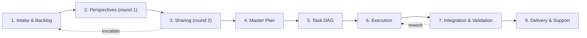
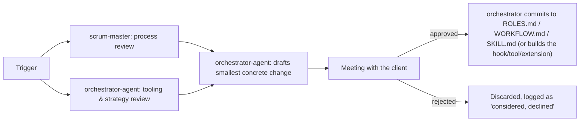

# dev-team — Work Protocol (Agentic Collaboration Cycle)

Referenced from `SKILL.md`. This defines **how** a request moves from "the client
asked for it" to "delivered, validated, and owned" — which stage, who runs it, and
what "done" means before moving on. Unlike a scripted pipeline, **the orchestrator
runs every stage conversationally** using the host's native sub-agent mechanisms;
this document is the playbook, not an engine.

## Two lanes — don't run every request through the full cycle

| Lane | When to use | What it skips |
| --- | --- | --- |
| **Fast Lane** | Single-role, low-risk, no escalation condition triggered (one-line bug fix, log lookup, doc tweak) | Backlog round, perspective/sharing rounds, cross-role review — goes straight from Intake → Execution (single role) → Validation → Report |
| **Full Cycle** | Multi-role work; anything touching code/infra/data/access beyond the trivial; anything that could hit an "Escalate to human" condition | Nothing — every stage below applies |

The orchestrator decides the lane at Intake and **says so explicitly**. When unsure,
default to Full Cycle — skipping a gate is cheap to avoid, expensive to undo.

**Even in Fast Lane, the orchestrator's final validation is never skipped** — that
is the mandate: no sub-agent result is accepted on trust.

## The cycle

### 1. Intake & Backlog

- **Owner:** `orchestrator-agent` routes; the matching role writes the backlog entry.
- **Does:** The orchestrator reads the request, picks the lane, and routes it to the
  correct role to **write the backlog item first**: product-manager (features/goals),
  business-analyst (requirements research), product-owner (prioritization),
  software-architect (architecture/tech-debt). The role returns a structured backlog
  entry: problem, users, success metrics, scope, product-level acceptance criteria.
- **Exit criteria:** A backlog item with measurable acceptance criteria that the
  validation stage can check against. The orchestrator confirms it with the client
  only when scope or success metrics are genuinely ambiguous.

### 2. Perspectives — round 1 (independent)

- **Owner:** `orchestrator-agent` dispatches; every relevant role contributes.
- **Does:** The orchestrator sends the backlog item to **each relevant role in
  parallel** — read-only, independent, no cross-talk. Each writes its own
  perspective: what it would do, what it worries about, what it would change, what
  it needs from other roles. This is the divergence step: the team thinks
  separately before it thinks together.
- **Exit criteria:** One perspective per activated role, each naming its key
  concern and its recommended approach.

### 3. Sharing — round 2 (collaborative)

- **Owner:** `orchestrator-agent`.
- **Does:** The orchestrator sends **every agent all other perspectives** and asks
  for a second turn: build on, challenge, or synthesize the others' ideas, and
  name what evidence moved them. Roles may converge, form coalitions, defend a
  minority position, or surface a conflict — the orchestrator records the outcome
  (converged / diverged / unresolved). Unresolved conflicts that change scope or
  approach go to the client at this point, not silently.
- **Exit criteria:** Every role has reacted to its peers; the shared insight is
  explicit; remaining disagreements are named.

### 4. Master Plan

- **Owner:** `orchestrator-agent` synthesizes; `software-architect` for
  architecture, `product-owner` for scope, `project-manager` for schedule (large
  work only).
- **Does:** The orchestrator turns the shared insight into the master plan:
  approach, architecture (ADR if warranted), scope decisions, risks, and the
  **acceptance gates** the team will build against.
- **Exit criteria:** One master plan everyone can see, with named gates and named
  risks. The orchestrator states it in the conversation so every later task prompt
  can reference it.

### 5. Task DAG

- **Owner:** `orchestrator-agent` (decomposition may consult `software-architect`).
- **Does:** The orchestrator decomposes the master plan into tasks and declares:
  - **owner role** per task (single owner — no shared ownership),
  - **dependencies**: which tasks block which (blocks / blocked-by),
  - **parallel set**: which tasks are independent and may run concurrently,
  - **execution tool**: native sub-agent, background agent, workflow script, or
    accepted external CLI — per task, per host capability,
  - **checkout strategy**: shared checkout (single writer at a time; reads may
    overlap) vs worktree isolation (parallel writers on conflicting files),
  - **model/thinking config**: per the policy below.
- **Exit criteria:** Every task has an owner, declared dependencies, a parallel
  position, a tool, a checkout strategy, and a model config. Cycles are forbidden —
  if task A blocks B and B blocks A, the orchestrator splits or merges until the
  graph is acyclic.

### 6. Execution

- **Owner:** the assigned role slot(s); `orchestrator-agent` monitors.
- **Does:** Dispatch in dependency order: independent tasks go out in parallel;
  dependent tasks start the moment their blockers report done. The orchestrator
  collects results, feeds them to dependent tasks, and re-dispatches failures with
  concrete feedback. **Single-writer rule:** with a shared checkout, exactly one
  write-enabled agent at a time; reads overlap freely. Use worktrees (or separate
  checkouts) when parallel writers would touch the same files.
- **Exit criteria:** Every task reports done with evidence (diff, tests run,
  verification), or is blocked with a reason the orchestrator resolves (re-dispatch,
  split, or escalate).

### 7. Integration & Validation

- **Owner:** `qa-engineer` (gate + security) and `orchestrator-agent` (final).
- **Does:**
  - **Gate-first where feasible:** for features, QA writes the acceptance gate
    (tests/checks from the acceptance criteria) **before** building starts, proves
    it starts red, and the team builds until it goes green.
  - **Regression + security cross-cut:** `qa-engineer` runs regression, dependency
    scans, secrets/access review, and refutes any security fix (an agent that did
    not write it tries to break it; a tie keeps the finding open).
  - **Final validation (never skipped):** the orchestrator checks the integrated
    result against the acceptance criteria, reads the actual diff, and confirms the
    executors' claims match reality. Failed validation sends work back to stage 6
    with concrete findings.
- **Exit criteria:** Every acceptance criterion verified with evidence; no open
  critical finding; the orchestrator's verdict is explicit (PASS / FAIL / PASS-WITH-NOTES).

### 8. Delivery & Support

- **Owner:** `orchestrator-agent`; `devops-engineer` for deploys.
- **Does:** Deliverable reaches its final destination (merge, deploy, publish).
  The orchestrator reports one consolidated result: what was done, by which
  role/agent/tool, how it was validated, what needs the client's decision. The team
  **owns the product from here**: bugs, support questions, and follow-on work
  re-enter the cycle at stage 1, and the orchestrator keeps the task tracker live so
  ownership is always answerable. For Full Cycle work, append a one-line retro note
  to the running in-session retro log.
- **Exit criteria:** The client has a clear single answer to "is it done and what
  happened", and the follow-up channel (bug/support → backlog) is acknowledged.

## Model & thinking policy

The orchestrator picks each role's model and thinking level **per task**, weighing:

1. **Complexity** — planning/architecture/security analysis → strongest available
   model, extended thinking. Mechanical refactors, test updates, tracking →
   cheapest adequate model, minimal thinking.
2. **Cost budget** — the client's stated budget caps the mix; the orchestrator
   tracks cumulative cost per session and downgrades tiers when a task doesn't need
   the top tier.
3. **Parallelism** — N parallel agents at top tier cost N×; parallelize with
   workhorse tiers and reserve the top tier for the bottlenecks (architecture,
   integration, validation).
4. **Provider caps** — when a provider is capped/degraded, reroute that task to an
   accepted alternative and note the switch in the report.

Defaults per role live in `ROLES.md` (smart/coding/fast tiers). On hosts with model
aliases (agent-cli: `agent-cli models set <alias> <provider/model>`), express the
tier as an alias; otherwise express intent in the dispatch prompt ("strongest
reasoning model, extended thinking" / "fast cheap model, minimal thinking").

## Escalation checkpoint (not a numbered stage — can fire from any stage)

- **Owner:** `orchestrator-agent`.
- **Does:** The moment any role's escalation condition (per `ROLES.md`) is hit, work
  pauses right there and the orchestrator opens a short meeting with the client via
  the host's ask-user mechanism — situation, options, recommendation. On
  resolution, work resumes at the stage it paused in, not from the top. This also
  covers the orchestrator's own triggers: first use of a not-yet-accepted tool, and
  tool switches with cost implications.

## Self-Improvement Loop

The team may improve its own definition and tooling — but only through this loop,
never as a side effect of normal work.

**Trigger** — the orchestrator starts this loop when either holds:

- The in-session retro log has accumulated **5 or more entries** since the last
  loop ran, or
- The client explicitly asks ("how's the team doing", "review the org", "can we
  improve this process").

**Review (two lenses on the same retro log):**

- `scrum-master` — process lens: rounds that stall (perspectives never shared, a
  role's voice missing), redundant reviews, slot-count mismatches.
- `orchestrator-agent` — tooling & strategy lens: dispatch mechanisms underused,
  providers repeatedly capped, quality escapes that a new hook/tool/extension would
  prevent, roster-vs-demand mismatches, model-tier choices that wasted cost.

**Draft** — the orchestrator drafts the smallest concrete change that addresses the
findings: a workflow adjustment, a new role card, a changed model-tier default, a
new hook/tool/extension, a changed escalation threshold. Prefers extending what
exists over adding new moving parts.

**Approve** — presented to the client as a short before/after diff via the host's
ask-user mechanism. Nothing is written until the client approves. If declined,
logged as "considered, declined" so the same idea isn't re-proposed without new
evidence.

**Commit** — only on approval, the orchestrator makes the edit (or builds the tool)
and confirms back to the client in one line what changed.

## RACI at a glance

| Stage | Responsible | Consulted | Informed |
| --- | --- | --- | --- |
| Intake & Backlog | orchestrator + routed role (PM/BA/PO/architect) | — | client |
| Perspectives (round 1) | orchestrator dispatches; all relevant roles | — | — |
| Sharing (round 2) | orchestrator; all relevant roles react | — | client (only on unresolved scope conflicts) |
| Master Plan | orchestrator | software-architect, product-owner, project-manager | all roles |
| Task DAG | orchestrator | software-architect | project-manager |
| Execution | assigned slots | tech-lead (referee) | orchestrator |
| Integration & Validation | qa-engineer + orchestrator | security cross-cut | client |
| Delivery & Support | orchestrator; devops-engineer for deploys | — | client |

## Status visibility

For any Full Cycle item, the orchestrator keeps a live task-tracker entry per stage
so the client can ask "where are we" mid-cycle and get the current stage, owner,
blocker (if any), and model tier per active task instantly.
