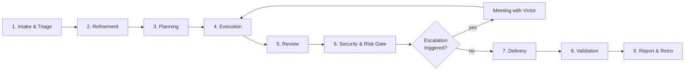
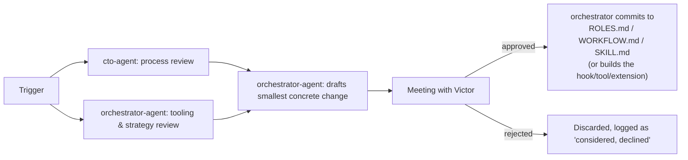

# dev-team — Work Cycle (Agile Delivery Process)

Referenced from `SKILL.md`. This defines **how** a request moves from "Victor asked
for it" to "done and validated" — which stage it passes through, who owns each stage,
and what "done" means before it moves on. Role capabilities live in `ROLES.md`;
routing lives in `SKILL.md`; this file is the process that connects them.

## Two lanes — don't run every request through the full cycle

| Lane | When to use | What it skips |
|---|---|---|
| **Fast Lane** | Single-role, low-risk, no escalation condition triggered (e.g. a one-line bug fix, a log lookup, a doc tweak) | Planning, cross-role review, retro — goes straight from Intake → Execution → Validation → Report |
| **Full Cycle** | Multi-role work, anything touching code/infra/data/access beyond the trivial, anything that could hit an "Escalate to human" condition | Nothing — every stage below applies |

`orchestrator-agent` decides the lane at Intake and says so explicitly. When unsure,
default to Full Cycle — skipping a gate is cheap to avoid, expensive to undo.

**Even in Fast Lane, the orchestrator's final validation (stage 8) is never skipped** —
that's the mandate: no sub-agent result is accepted on trust.

## The cycle

### 1. Intake & Triage
- **Owner:** `orchestrator-agent`
- **Does:** Reads Victor's request, matches it to role(s) in `ROLES.md`, picks the lane, splits cross-cutting work. A request outside software development doesn't get forced onto the closest role — it goes back to Victor (see `SKILL.md` routing table).
- **Exit criteria:** Every subtask has exactly one owning role and a lane assigned.

### 2. Refinement
- **Owner:** `orchestrator-agent`
- **Consulted:** `cto-agent` for anything architecturally loaded.
- **Does:** Turns the raw request into a concrete spec — acceptance criteria, scope boundaries, what "done" looks like. These acceptance criteria are also what stage 8's validation will check against, so write them measurably. Skipped in Fast Lane (the request IS the spec).
- **Exit criteria:** A one-paragraph spec the executing agent(s) can work from without re-asking Victor.

### 3. Planning
- **Owner:** `cto-agent`
- **Does:** Breaks the spec into an ordered task list: which `dev-agent` slot(s), what runs in parallel vs. sequentially, whether `devops-agent`/`security-agent` involvement is needed, and which execution mechanism and tool each block uses — Agent tool, workflow script, or an accepted external agent CLI (pi/codex/…), chosen by the orchestrator per `SKILL.md`'s mandate.
- **Exit criteria:** Every task has an assigned slot, a declared position in the sequence, and a named execution mechanism + tool.

### 4. Execution
- **Owner:** the assigned executor slot(s) — `dev-agent-N`, `devops-agent`, whichever the plan named — running on whichever accepted tool the orchestrator dispatched them through.
- **Does:** The actual work, per that role's card in `ROLES.md`. The orchestrator dispatches and monitors; it does not implement.
- **Exit criteria:** Deliverable exists (PR, config, test suite, report) and is self-checked against the Refinement spec.

### 5. Review
- **Owner:** the natural peer — a second `dev-agent` slot or `cto-agent` for code, `qa-agent` for anything needing test coverage.
- **Does:** Checks the deliverable against the spec and the quality bar — not a rubber stamp. Sends it back to stage 4 with concrete feedback if it doesn't hold up. The reviewer must not be the slot that authored the work.
- **Exit criteria:** Reviewer explicitly signs off; feedback loop closed.

### 6. Security & Risk Gate
- **Owner:** `security-agent` — **mandatory for anything touching code, infrastructure, data, or access control; skipped only for pure documentation/analysis work that touches none of those.**
- **Does:** Runs its standard checks from `ROLES.md` (SAST/DAST, dependency scan, access/secrets review, compliance as relevant). Runs continuously in the background per its cross-audit authority, but must explicitly clear before stage 7 for anything in scope.
- **Refute pass — mandatory for every fix made in response to a security finding.** The fix goes to an agent that did **not** write it (`qa-agent`, or a `dev-agent` slot other than the one that fixed it), prompted to **break** it rather than review it, and pointed at the running system — the wire, the socket, the rendered screen — not only at the source. A refutation is closed by replaying its exact payload against the new code, never by argument. If fixer and refuter disagree, a third agent gets both artefacts and decides: majority rules, and a tie leaves the finding **open**.
- **Exit criteria:** No open critical finding, or findings triaged and accepted knowingly — **and every fix has survived a refute pass.** "Reviewed and looks correct" does not clear this gate.

### Escalation checkpoint (not a numbered stage — can fire from any stage above)
- **Owner:** `orchestrator-agent`
- **Does:** The moment any role's "Escalate to human" condition (per `ROLES.md`) is hit at any stage, work pauses right there and the orchestrator opens a short meeting with Victor via **AskUserQuestion** — situation, options, recommendation. On resolution, work resumes at the stage it paused in, not from the top. This also covers the orchestrator's own triggers: first use of a not-yet-accepted agent tool, and tool switches with cost implications.

### 7. Delivery
- **Owner:** `devops-agent` for deploys; otherwise the owning executor ships its own deliverable.
- **Exit criteria:** Deliverable is in its final destination, not just "ready."

### 8. Validation
- **Owner:** split in two, both mandatory:
  - `qa-agent` — engineering verification: tests pass, the change works in the real environment (UI/frontend changes verified in a real browser, not just a green build).
  - `orchestrator-agent` — **final validation, the mandate's step**: checks the delivered result against the Refinement acceptance criteria, reads the actual diff, confirms the executor's claims match reality. This applies in **both lanes** and is never delegated away — it's the quality gate Victor holds the orchestrator accountable for.
- **Exit criteria:** Confirmed working / confirmed matches spec — not assumed. Failed validation sends the work back to stage 4 with the orchestrator's concrete findings.

### 9. Report & Retro
- **Owner:** `orchestrator-agent`
- **Does:** One consolidated report to Victor: what was done, by which agent/tool (including any usage-limit switches made mid-task), how it was validated, what needs Victor's decision. For Full Cycle work, also a one-line retro note appended to the running in-session retro log — raw material for the Self-Improvement Loop.
- **Exit criteria:** Victor has a clear, single answer to "is it done and what happened."

## Self-Improvement Loop

The team may improve its own definition and tooling — but only through this loop,
never as a side effect of normal work.

**Trigger** — the orchestrator starts this loop when either holds:
- The in-session retro log has accumulated **5 or more entries** since the last loop ran, or
- Victor explicitly asks ("how's the team doing", "review the org", "can we improve this process").

It never runs mid-task, and one bad retro is noise — a pattern across several is signal.

**Review (two lenses on the same retro log):**
- `cto-agent` — process lens: stages that stall or get skipped, redundant reviews, slot-count mismatches.
- `orchestrator-agent` — tooling & strategy lens: dispatch mechanisms underused, providers repeatedly capped, quality escapes that a new hook/tool/extension or workflow script would prevent, roster-vs-demand mismatches.

**Draft** — the orchestrator drafts the smallest concrete change that addresses the
findings: a workflow adjustment, a slot-count change, a new hook/tool/extension, a
changed escalation threshold. Prefers extending what exists over adding new moving parts.

**Approve** — presented to Victor as a short before/after diff via **AskUserQuestion**.
Nothing is written until Victor approves. If declined, logged as "considered,
declined" so the same idea isn't re-proposed without new evidence.

**Commit** — only on approval, the orchestrator makes the edit (or builds the tool)
and confirms back to Victor in one line what changed.

## RACI at a glance

| Stage | Responsible | Consulted | Informed |
|---|---|---|---|
| Intake & Triage | orchestrator-agent | — | Victor |
| Refinement | orchestrator-agent | cto-agent | executor slots |
| Planning | cto-agent | orchestrator-agent | executor slots |
| Execution | assigned slot(s) | — | orchestrator-agent |
| Review | peer slot / cto-agent / qa-agent | — | executor |
| Security & Risk Gate | security-agent | qa-agent (refute pass) | cto-agent |
| Escalation checkpoint | orchestrator-agent | role that triggered it | Victor (decision-maker) |
| Delivery | devops-agent / owning executor | — | orchestrator-agent |
| Validation | qa-agent + orchestrator-agent | — | Victor |
| Report & Retro | orchestrator-agent | — | Victor |

## Status visibility

For any Full Cycle item, the orchestrator keeps a live TaskCreate/TaskUpdate entry per
stage so Victor can ask "where are we" mid-cycle and get the current stage, owner, and
blocker (if any) instantly.
